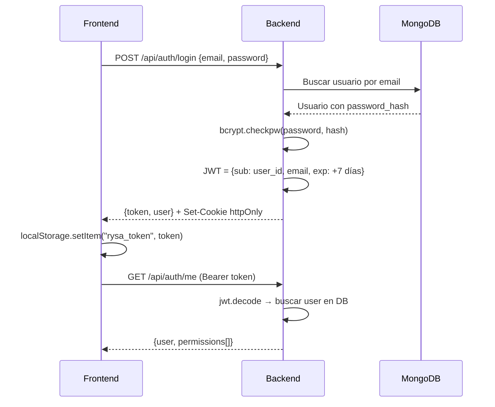

# Análisis del Proyecto ERP RYSA

## 1. Estructura General

El proyecto es un ERP/POS web full-stack generado originalmente con **Emergent**, con la siguiente organización:

```
Rysa/
├── backend/               # API Python/FastAPI
│   ├── server.py          # Archivo monolítico (~2100 líneas) con TODOS los endpoints
│   ├── deps.py            # MongoDB, JWT, RBAC, auditoría, contadores
│   ├── storage.py         # Object storage (Emergent) + generación de tickets PDF
│   ├── .env               # Variables de entorno (MongoDB Atlas, JWT secret, admin seed)
│   └── requirements.txt   # 134 dependencias Python
├── frontend/              # React 19 + TailwindCSS + shadcn/ui
│   ├── src/
│   │   ├── App.js         # Router principal (react-router-dom v7)
│   │   ├── pages/         # 16 páginas JSX
│   │   ├── components/    # Componentes reutilizables
│   │   ├── context/       # AuthContext (estado global de sesión)
│   │   ├── hooks/         # use-toast
│   │   ├── lib/           # api (axios), utilidades
│   │   └── constants/
│   ├── package.json       # CRA + CRACO, TailwindCSS, shadcn/ui (Radix), recharts
│   └── tailwind.config.js
├── memory/
│   └── PRD.md             # Documento de requisitos (~126 líneas, historial completo)
└── tests/                 # Solo __init__.py (sin tests automatizados activos)
```

### Stack tecnológico

| Capa | Tecnología |
|------|-----------|
| **Backend** | Python 3, FastAPI 0.110, Uvicorn, Motor (async MongoDB) |
| **Base de datos** | MongoDB Atlas (cluster `cluster0.1krcnbl.mongodb.net`, db: `rysa`) |
| **Auth** | JWT (PyJWT), bcrypt, cookies httpOnly + Bearer header |
| **Frontend** | React 19, CRA + CRACO, TailwindCSS 3, shadcn/ui (Radix), recharts, framer-motion, Lucide icons |
| **Almacenamiento** | Emergent Object Storage (imágenes, PDFs) |
| **PDF** | reportlab (tickets 80mm y carta) |
| **Import/Export** | pandas, openpyxl, xlrd (XLSX/XLS/CSV) |

> [!IMPORTANT]
> El backend es un **único archivo monolítico** ([server.py](file:///c:/Users/emili/OneDrive/Desktop/Rysa/backend/server.py)) de ~2100 líneas que contiene todos los modelos, endpoints y lógica de negocio. No hay separación por módulos/routers.

---

## 2. Autenticación y Autorización

### Flujo de autenticación



### Detalles clave

- **Hash**: `bcrypt` ([deps.py:22-29](file:///c:/Users/emili/OneDrive/Desktop/Rysa/backend/deps.py#L22-L29))
- **JWT**: HS256, secreto en `.env`, expiración **7 días** ([deps.py:37-40](file:///c:/Users/emili/OneDrive/Desktop/Rysa/backend/deps.py#L37-L40))
- **Doble canal**: Cookie httpOnly (`access_token`, SameSite=None, Secure) + Header `Authorization: Bearer` ([deps.py:66-85](file:///c:/Users/emili/OneDrive/Desktop/Rysa/backend/deps.py#L66-L85))
- **Admin seed**: Se crea automáticamente en `startup()` con las credenciales de `.env` (`test@gmail.com` / `REDACTED`)

### RBAC (Control de acceso por roles)

Definido en [deps.py:43-60](file:///c:/Users/emili/OneDrive/Desktop/Rysa/backend/deps.py#L43-L60):

| Rol | Permisos |
|-----|----------|
| **admin** | `*` (acceso total) |
| **encargado** | Productos (CRUD+baja+costo+precio), inventario, ventas (crear+cancelar+descuento), caja completa, clientes, reportes, import/export, usuarios, config, crédito |
| **vendedor** | Venta (crear+descuento), clientes (crear+editar), exportar |
| **cajero** | Caja (abrir+cerrar+retiro+entrada), venta (crear), exportar |

- `require_permission("permiso")` es un **Depends** de FastAPI que verifica el rol del usuario
- Frontend: `useAuth().can("permiso")` para habilitar/deshabilitar acciones en la UI

> [!WARNING]
> El JWT secret es débil (`REDACTED`) y las credenciales de admin/MongoDB están en texto plano en `.env`. Esto es inseguro para producción.

---

## 3. Módulos y Endpoints Existentes

### Mapa completo de endpoints (`/api/...`)

#### Auth
| Método | Ruta | Permiso | Descripción |
|--------|------|---------|-------------|
| POST | `/auth/login` | Público | Login → JWT + cookie |
| POST | `/auth/logout` | Autenticado | Logout (borra cookie) |
| GET | `/auth/me` | Autenticado | Usuario actual + permisos |

#### Usuarios
| Método | Ruta | Permiso | Descripción |
|--------|------|---------|-------------|
| GET | `/users` | `usuarios.ver` | Listar usuarios |
| POST | `/users` | `usuarios.ver` | Crear usuario |
| PUT | `/users/{id}` | `usuarios.ver` | Editar usuario |
| GET | `/roles` | Autenticado | Mapa de roles→permisos |

#### Productos
| Método | Ruta | Permiso | Descripción |
|--------|------|---------|-------------|
| GET | `/products` | Autenticado | Listar (filtros: estado, búsqueda, bajo_stock, sin_existencia, categoría, paginación) |
| GET | `/products/{id}` | Autenticado | Detalle |
| POST | `/products` | `producto.crear` | Crear (auto-genera código P00001) |
| PUT | `/products/{id}` | `producto.editar` | Editar (no cambia existencia) |
| PATCH | `/products/{id}/estado` | `producto.baja` | Cambiar estado |
| GET | `/products/{id}/movimientos` | Autenticado | Kardex del producto |
| POST | `/products/{id}/ajuste` | `inventario.ajuste` | Ajuste inventario (entrada/salida/ajuste/merma/devolución/corrección) |
| GET | `/products/export/excel` | `exportar` | Exportar a XLSX |
| GET | `/products/plantilla/excel` | Autenticado | Plantilla 85 columnas |
| POST | `/products/import/preview` | `importar` | Preview importación |
| POST | `/products/import/confirm` | `importar` | Confirmar importación |

#### Inventario
| Método | Ruta | Permiso | Descripción |
|--------|------|---------|-------------|
| GET | `/inventory/movements` | Autenticado | Movimientos globales (filtros: tipo, búsqueda, rango fechas, paginación) |

#### Categorías
| Método | Ruta | Permiso | Descripción |
|--------|------|---------|-------------|
| GET | `/categories` | Autenticado | Listar (con conteo de productos) |
| POST | `/categories` | `producto.editar` | Crear/actualizar categoría |

#### Clientes
| Método | Ruta | Permiso | Descripción |
|--------|------|---------|-------------|
| GET | `/clients` | Autenticado | Listar (filtros: estado, tipo, crédito, saldo, ofertas, búsqueda ampliada) |
| POST | `/clients` | `cliente.crear` | Crear (52 campos legacy DBF) |
| PUT | `/clients/{id}` | `cliente.editar` | Editar (no modifica saldo) |
| PATCH | `/clients/{id}/estado` | `cliente.editar` | Cambiar estado |
| PATCH | `/clients/{id}/credito-toggle` | `credito.autorizar` | Habilitar/deshabilitar crédito |
| PATCH | `/clients/{id}/credito` | `credito.autorizar` | Configurar límite de crédito |
| GET | `/clients/export/excel` | `exportar` | Exportar a XLSX |
| GET | `/clients/plantilla/excel` | Autenticado | Plantilla legacy |
| POST | `/clients/import/preview` | `importar` | Preview importación |
| POST | `/clients/import/confirm` | `importar` | Confirmar importación |

#### Caja
| Método | Ruta | Permiso | Descripción |
|--------|------|---------|-------------|
| GET | `/caja/actual` | Autenticado | Caja abierta del usuario + movimientos + resumen |
| POST | `/caja/abrir` | `caja.abrir` | Abrir caja con fondo inicial |
| POST | `/caja/movimiento` | `caja.entrada` | Registrar movimiento (entrada/retiro/gasto/ajuste) |
| POST | `/caja/cerrar` | `caja.cerrar` | Cerrar con conteo de efectivo |
| GET | `/caja/historial` | Autenticado | Historial de cortes |

#### Ventas / POS
| Método | Ruta | Permiso | Descripción |
|--------|------|---------|-------------|
| GET | `/sales` | Autenticado | Listar (filtros: rango, estado, vendedor, búsqueda) |
| GET | `/sales/{id}` | Autenticado | Detalle |
| POST | `/sales` | `venta.crear` | Crear venta/cotización |
| PUT | `/sales/{id}/cliente` | `venta.crear` | Cambiar cliente de venta |
| POST | `/sales/{id}/cancelar` | `venta.cancelar` | Cancelar (revierte inventario+caja+crédito) |
| POST | `/sales/suspend` | `venta.crear` | Suspender venta |
| GET | `/sales-suspended` | Autenticado | Ventas suspendidas |
| DELETE | `/sales-suspended/{id}` | Autenticado | Eliminar suspendida |
| GET | `/sales-next-folio` | Autenticado | Próximos folios V/COT |

#### Recargas
| Método | Ruta | Permiso | Descripción |
|--------|------|---------|-------------|
| POST | `/recargas` | `venta.crear` | Registrar recarga de celular |

#### Cuentas por Cobrar (CxC)
| Método | Ruta | Permiso | Descripción |
|--------|------|---------|-------------|
| GET | `/cxc` | Autenticado | Cartera con antigüedad (aging buckets) |
| GET | `/cxc/{client_id}` | Autenticado | Estado de cuenta del cliente |
| POST | `/cxc/{client_id}/abono` | `caja.entrada` | Registrar abono (aplica FIFO) |

#### Facturación CFDI 4.0 (PAC: Facty.mx)
| Método | Ruta | Permiso | Descripción |
|--------|------|---------|-------------|
| GET | `/facturacion/config` | `config` | Configuración PAC |
| PUT | `/facturacion/config` | `config` | Guardar config PAC |
| GET | `/facturacion/timbres` | Autenticado | Consultar timbres disponibles |
| GET | `/facturacion` | Autenticado | CFDI emitidos |
| GET | `/facturacion/facturables` | Autenticado | Ventas sin facturar |
| POST | `/facturacion/sale/{id}` | `venta.crear` | Timbrar CFDI |
| GET | `/facturacion/{id}/{xml\|pdf}` | Autenticado | Descargar XML/PDF |
| POST | `/facturacion/{id}/cancel` | `venta.cancelar` | Cancelar CFDI |

#### Dashboard y Reportes
| Método | Ruta | Permiso | Descripción |
|--------|------|---------|-------------|
| GET | `/dashboard` | Autenticado | Métricas (ventas día/mes, caja, stock, gráfica 7 días) |
| GET | `/reports/ventas` | Autenticado | Reporte de ventas y utilidad (por día/mes, top vendidos, top utilidad) |

#### Archivos y Storage
| Método | Ruta | Permiso | Descripción |
|--------|------|---------|-------------|
| POST | `/uploads/image` | Autenticado | Subir imagen (≤8MB) |
| GET | `/files/{path}` | Público* | Servir archivo |
| POST | `/sales/{id}/ticket-pdf` | Autenticado | Generar ticket PDF |

#### Otros
| Método | Ruta | Permiso | Descripción |
|--------|------|---------|-------------|
| GET | `/vendedores` | Autenticado | Lista de vendedores activos |
| GET | `/audit` | `reportes.ver` | Log de auditoría |
| GET | `/settings` | Autenticado | Configuración general |
| PUT | `/settings` | `config` | Actualizar configuración |

---

### Colecciones MongoDB utilizadas

| Colección | Propósito |
|-----------|-----------|
| `users` | Usuarios del sistema |
| `products` | Catálogo de productos (85 campos DBF + campos ERP) |
| `categories` | Metadata de categorías |
| `clients` | Clientes (52 campos legacy) |
| `sales` | Ventas, cotizaciones, recargas |
| `suspended_sales` | Ventas en pausa |
| `inventory_movements` | Kardex de movimientos |
| `cajas` | Sesiones de caja |
| `caja_movimientos` | Movimientos de caja |
| `abonos` | Abonos a CxC |
| `cfdi_documents` | Facturas CFDI emitidas |
| `pac_config` | Configuración del PAC |
| `settings` | Configuración general del ERP |
| `counters` | Folios auto-incrementales |
| `audit_logs` | Bitácora de auditoría |
| `files` | Registro de archivos subidos |

---

### Páginas del Frontend

| Ruta | Componente | Descripción |
|------|-----------|-------------|
| `/` | `Landing.jsx` | Página pública (hero, categorías, contacto) |
| `/login` | `Login.jsx` | Formulario de login |
| `/app/dashboard` | `Dashboard.jsx` | Panel principal con métricas |
| `/app/productos` | `Productos.jsx` | CRUD productos + kardex + movimientos |
| `/app/categorias` | `Categorias.jsx` | Gestión de categorías |
| `/app/clientes` | `Clientes.jsx` | CRUD clientes (52 campos, 10 pestañas) |
| `/app/cxc` | `CuentasPorCobrar.jsx` | Cuentas por cobrar + abonos |
| `/app/pos` | `POS.jsx` | Punto de venta |
| `/app/caja` | `Caja.jsx` | Gestión de caja |
| `/app/ventas` | `Ventas.jsx` | Historial de ventas |
| `/app/recargas` | `Recargas.jsx` | Recargas de celular |
| `/app/facturacion` | `Facturacion.jsx` | CFDI 4.0 |
| `/app/reportes` | `Reportes.jsx` | Reportes de ventas y utilidad |
| `/app/usuarios` | `Usuarios.jsx` | Gestión de usuarios |
| `/app/configuracion` | `Configuracion.jsx` | Settings generales + ticket + PAC |
| `/app/auditoria` | `Auditoria.jsx` | Log de auditoría |

> [!NOTE]
> La facturación CFDI está **estructuralmente lista** pero sin credenciales reales de Facty.mx. Los endpoints de timbrado no han sido probados en vivo.
